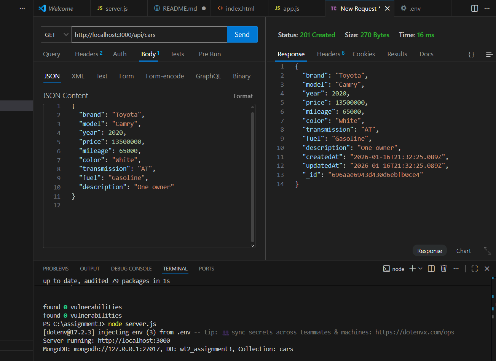
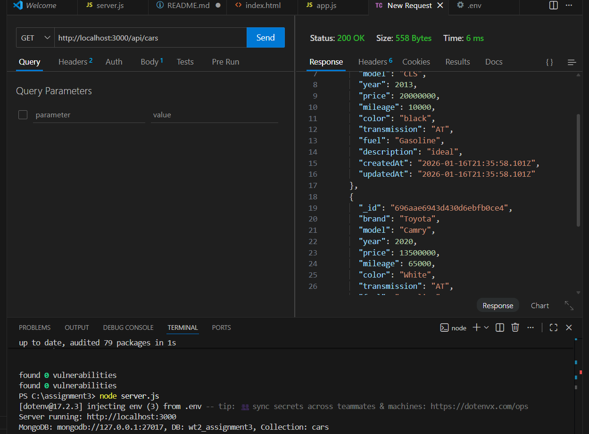
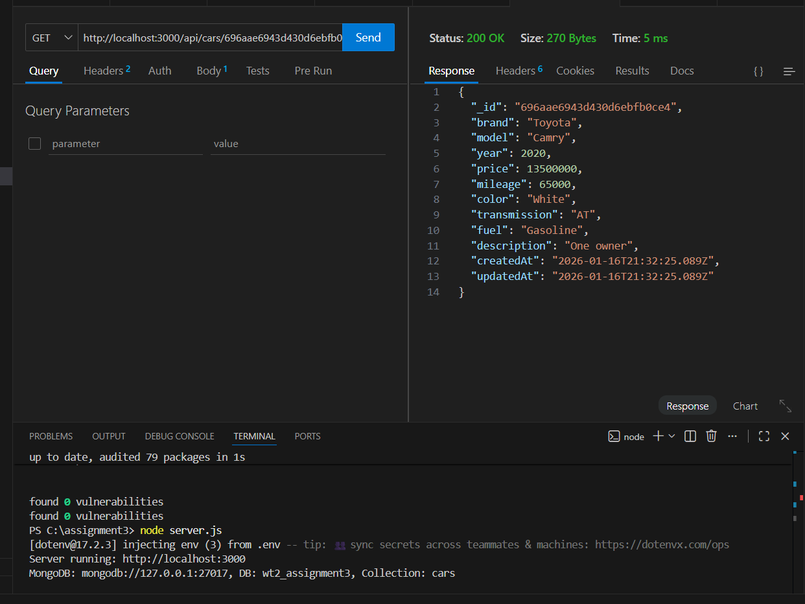
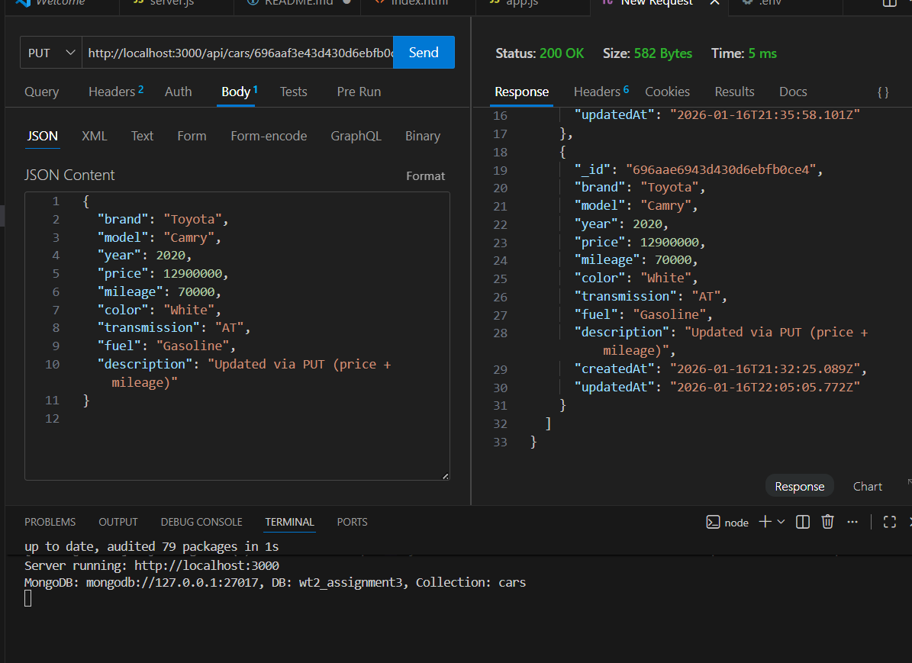
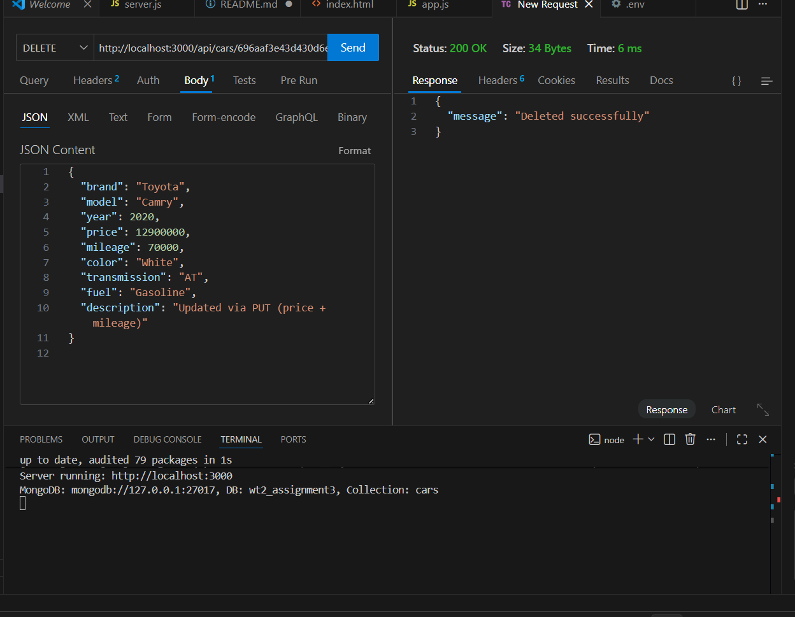
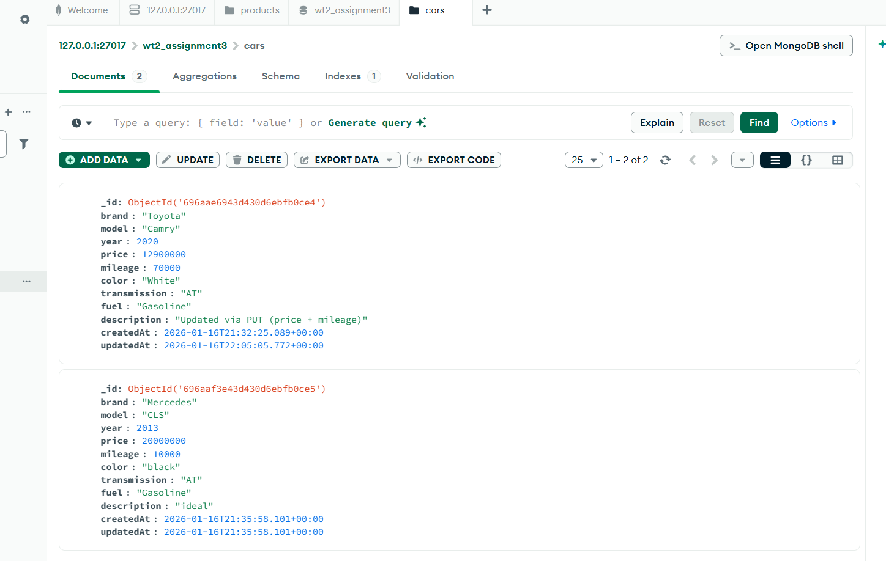
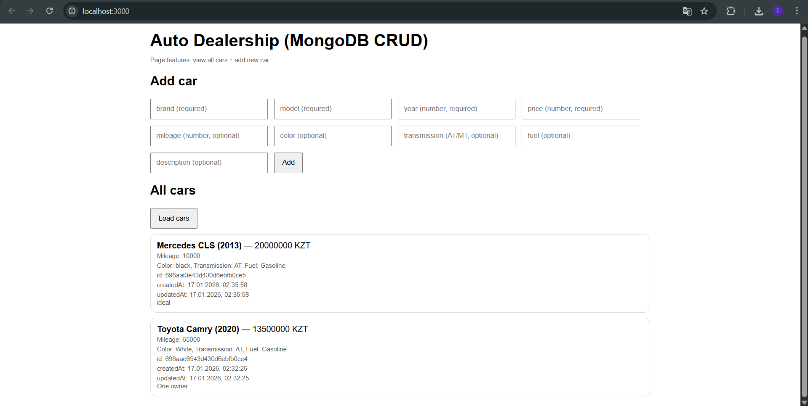

 **Student:** Nurlan Ramazan
 **Group:** SE-2431 

---

## Introduction

This project is made for **WT2 Assignment 3**.  
The goal is to replace the old JSON storage with **MongoDB** and build a full **CRUD REST API** for a real project topic.  
I selected the topic **Auto Dealership**, where the main object is **Car**.  
The system allows users to add cars, view all cars, view one car by ID, update car data, and delete cars.

**Main technologies:**
- Node.js + Express
- MongoDB (Local) + MongoDB Compass
- Postman (manual testing)
- Simple HTML/JS interface

---

## Project Requirements Checklist

 MongoDB used instead of JSON file storage  
 Primary object is related to the final project topic (**cars**)  
 Required fields: **brand, model, year, price**  
 Timestamps: **createdAt, updatedAt**  
 CRUD API endpoints implemented (POST/GET/GET:id/PUT/DELETE)  
 Validation for POST and PUT  
 Correct status codes (201, 400, 404, 500)  
 Manual testing in Postman  
 Simple user interface for viewing and creating cars  

---

## Project Structure

assignment3-mongo/
server.js
.env
public/
index.html
app.js
README.md


---

## Data Model (Car)

**Collection name:** `cars`

### Required fields
- `brand` (string)
- `model` (string)
- `year` (number)
- `price` (number)

### Optional fields
- `mileage` (number or null)
- `color` (string)
- `transmission` (string)
- `fuel` (string)
- `description` (string)

### Auto fields
- `createdAt` (date)
- `updatedAt` (date)
- `_id` (MongoDB ObjectId)

---

## How to Run the Project

### 1) Install dependencies
```bash
npm install
```
2) Create .env file

Create a file named .env in the root folder:

MONGO_URI=mongodb://127.0.0.1:27017
DB_NAME=wt2_assignment3
PORT=3000


3) Start MongoDB (Local)

Make sure your MongoDB Server is running (Compass must connect).

MongoDB Compass connection string:
mongodb://127.0.0.1:27017

4) Run the server
node server.js

### 1) Create Car (POST)

POST /api/cars

 Returns 201 Created if successful
 Returns 400 Bad Request if validation fails

Example JSON:
```bash
{
  "brand": "Toyota",
  "model": "Camry",
  "year": 2020,
  "price": 13500000,
  "mileage": 65000,
  "color": "White",
  "transmission": "AT",
  "fuel": "Gasoline",
  "description": "One owner"
}
```




### 2) Get All Cars (GET)

GET /api/cars

 Returns list of cars + count



### 3) Get Car by ID (GET)

GET /api/cars/:id

 200 if found
 400 if invalid id
 404 if not found



### 4) Update Car (PUT)

PUT /api/cars/:id

 200 if updated
 400 if validation fails / invalid id
 404 if not found

Example JSON:
```bash
{
  "brand": "Toyota",
  "model": "Camry",
  "year": 2020,
  "price": 12900000,
  "mileage": 70000,
  "color": "White",
  "transmission": "AT",
  "fuel": "Gasoline",
  "description": "Price updated"
}
```


### 5) Delete Car (DELETE)

DELETE /api/cars/:id

 200 if deleted
 400 if invalid id
 404 if not found



### Validation Rules

Validation is applied for POST and PUT requests.

Required fields rules:

brand must be a non-empty string

model must be a non-empty string

year must be a number (1950–2100)

price must be a number (>= 0)

If any required field is missing or invalid → server returns:

400 Bad Request with error details.







### Conclusion

In this assignment, I successfully replaced JSON storage with MongoDB and built a complete CRUD REST API for an Auto Dealership project.
The API supports creating, reading, updating, and deleting cars with proper validation and status codes.
All endpoints were tested in Postman, and the data was verified in MongoDB Compass.
A simple web interface was added to view and create cars from the browser.
